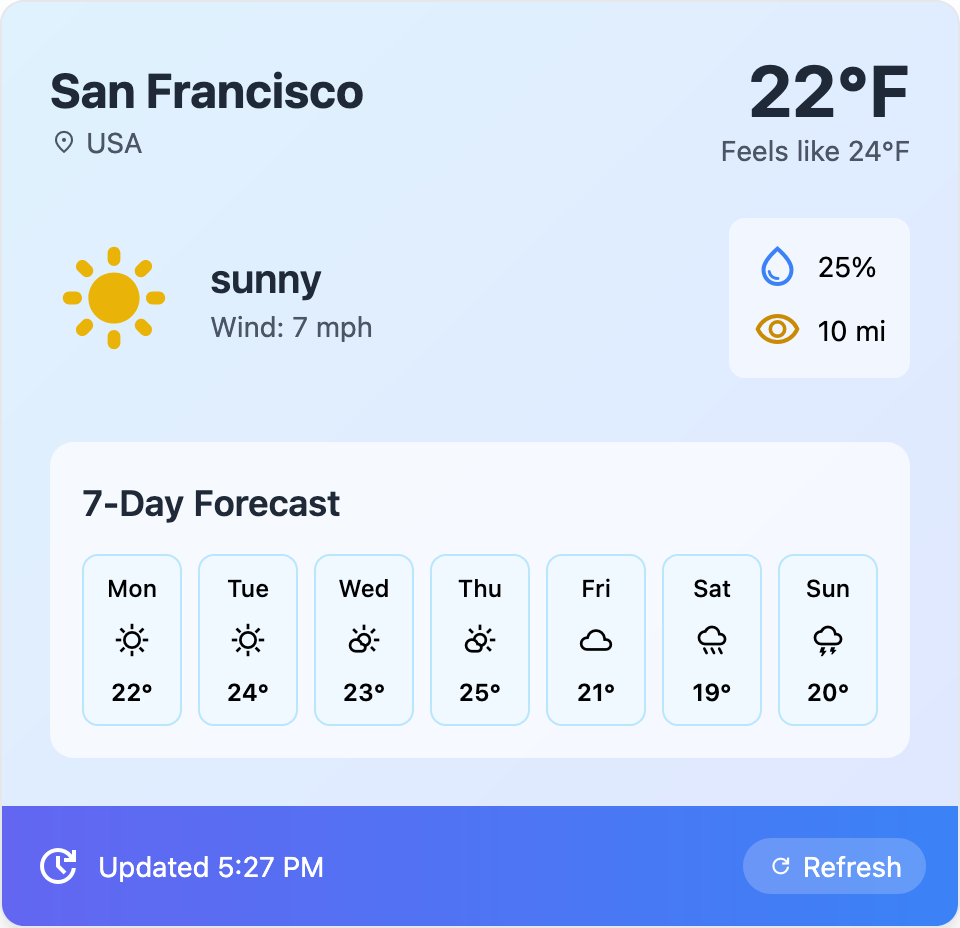

# 📦 Weather Widget

A simple and beautiful weather widget built with **Angular** and **Tailwind CSS**.  
It uses **mock data** to simulate real weather information and includes a **loading spinner** for a smooth user experience.

---

## ✨ Features

- Displays **current weather** information (city, temperature, feels like, wind speed, humidity, visibility)
- **7-day forecast** dynamically generated
- **Loading spinner** when refreshing data
- **Mock data** used instead of real API for instant load and easy portfolio showcasing
- Built with **Angular 19** and **Tailwind CSS 3**

---

## 🚀 Tech Stack

- [Angular](https://angular.io/)
- [Tailwind CSS](https://tailwindcss.com/)
- [Material Symbols](https://fonts.google.com/icons) (for weather icons)

---

## 📸 Screenshots

|                          Weather View                           |                          Loading Spinner                          |
| :-------------------------------------------------------------: | :---------------------------------------------------------------: |
|  |  |

---

## 🛠️ Installation

```bash
# Clone the repository
git clone https://github.com/MariannSz/angular-weather-widget.git

# Navigate into the project
cd angular-weather-widget

# Install dependencies
npm install

# Run the development server
ng serve
```

The app will be available at [http://localhost:4200](http://localhost:4200) 🚀

---

## 🧠 How It Works

- Weather data is **mocked** locally in `app.component.ts`
- The app uses `*ngIf` to **show a loading spinner** when refreshing
- The **7-day forecast** cards are dynamically generated using `*ngFor`
- Clicking the **Refresh** button simulates reloading data with a short delay

---

## 📄 License

This project is open-source and free to use for educational and portfolio purposes.
